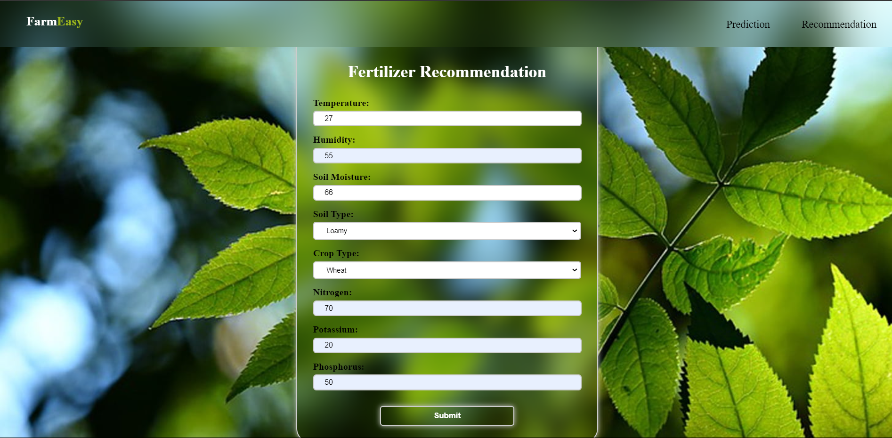
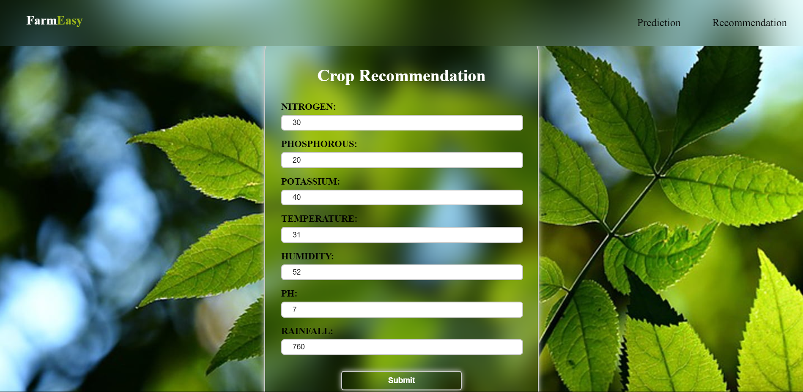

# FarmEasy

FarmEasy is a comprehensive web application aimed at assisting farmers with various agricultural tasks, leveraging machine learning algorithms and data analysis techniques.

## Features

### Crop Prediction
Predicts the most suitable crop to cultivate based on user-provided parameters such as state, district, and season. The prediction is based on historical crop yield data and climatic conditions.

### Crop Recommendation
Recommends crops based on soil type, climate, and other environmental factors. Users can input details about their land and environmental conditions to receive personalized crop recommendations.

### Rainfall Prediction
Provides forecasts for average rainfall in a selected region and month. Utilizes historical rainfall data to predict future rainfall patterns, helping farmers make informed decisions regarding crop cultivation and irrigation.

### Yield Prediction
Predicts the expected yield of a specific crop based on various factors such as geographical location, soil quality, weather conditions, and agricultural practices. Helps farmers estimate potential harvests and optimize resource allocation.

### Fertilizer Recommendation
Recommends suitable fertilizers based on soil type, crop type, and nutrient requirements. Utilizes machine learning models to analyze soil composition and crop nutrient needs, ensuring optimal fertilization practices.

## Setup Instructions

1. Clone the repository:

   ```bash
   git clone [https://github.com/YourUsername/FarmEasy.git](https://github.com/Viraj1923/FarmEasy.git)

2. Install dependencies:

   ```bash
   pip install -r requirements.txt
   ```

3. Run the Flask application:

   ```bash
   python app.py
   ```

4. Access the web application in your browser at `http://localhost:5000`.

## Usage

1. **Home Page**: Navigate to the desired functionality from the home page.
2. **Form Input**: Fill in the required information in the provided forms.
3. **Prediction/Recommendation**: Click on the submit button to get predictions or recommendations.
4. **Result Display**: Follow on-screen instructions for each functionality. Results are displayed on the web page.

## Folder Structure

- `templates/`: Contains HTML templates for the web pages.
- `static/`: Includes static files such as CSS stylesheets, JavaScript scripts, and images.
- `model/`: Contains machine learning models, datasets, and related files.
- `app.py`: Main Flask application file responsible for routing and handling requests.

## Contributors

- [Viraj Mulik](mailto:virajmulik2304@gmail.com)
- [Onkar Giri](mailto:onkargiri29@gmail.com)
- [Digvijay Pawar](mailto:digvijaypawar.kit@gmail.com)

## License

This project is licensed under the MIT License - see the [LICENSE.md](LICENSE) file for details.

## Contact

For any inquiries or feedback, contact at [virajmulik2304@gmail.com](mailto:virajmulik2304@gmail.com).
[digvijaypawar.kit@gmail.com](mailto:digvijaypawar.kit@gmail.com).

...


...


...



